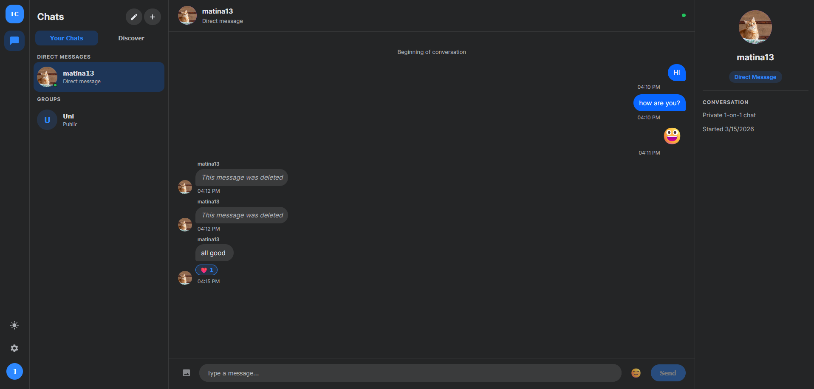

# LiveChat

A real-time chat application built with Spring Boot and React.

## Preview



## Features


- **Messaging** — Send text messages and images, edit/delete your own, reply to messages, react with emojis
- **Rooms** — Create public or private group rooms, join via discovery, leave or delete (owner)
- **Direct Messages** — Start a DM with any user by searching their username
- **Real-time** — Instant delivery via WebSocket/STOMP, typing indicators, online presence
- **Auth** — Register/login with JWT access tokens (60 min) and refresh tokens (7 days)

## Tech Stack

| Layer | Technology |
|---|---|
| Frontend | React 19, React Router 7, Vite, Axios, STOMP.js |
| Backend | Spring Boot 3.4.2, Java 21, Spring Security (JWT) |
| Database | PostgreSQL, Spring Data JPA, Flyway |
| Real-time | WebSocket / STOMP over SockJS |

## Prerequisites

- Java 21+
- Node.js 18+
- PostgreSQL running on `localhost:5433`

## Setup

### Database

Create the database and user:

```sql
CREATE USER chat_user WITH PASSWORD 'root';
CREATE DATABASE chat_db OWNER chat_user;
```

Flyway will apply all migrations automatically on startup.

### Backend

```bash
./mvnw spring-boot:run
```

Runs on `http://localhost:8080`.

Set `APP_JWT_SECRET` env var in production to override the default JWT secret.

### Frontend

```bash
cd frontend
npm install
npm run dev
```

Runs on `http://localhost:5173`.

## Project Structure

```
├── src/                        # Spring Boot backend
│   └── main/java/com/example/livechat/
│       ├── auth/               # Register, login, token refresh
│       ├── rooms/              # Room CRUD, membership, DMs
│       ├── messages/           # Messages, reactions, image upload
│       ├── users/              # User search
│       ├── websocket/          # STOMP controllers, presence
│       └── security/           # JWT config, filters
├── frontend/src/
│   ├── pages/                  # RoomsPage (main), LoginPage, RegisterPage
│   ├── components/             # Sidebar, ChatList, ChatMain, RoomInfo
│   └── api/                    # Axios clients, WebSocket factory
└── src/main/resources/
    └── db/migration/           # Flyway SQL migrations
```
